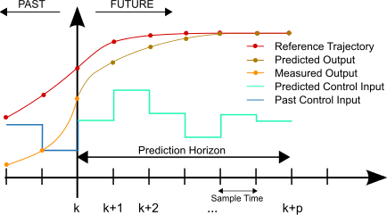

# MPC Project
[](http://www.udacity.com/drive)

This project implements a MPC (Model Predictive Controller) to use with the Udacity car simulator.  With the MPC running, the car will autonomously drive around the track at high speeds.  The simulator includes visual indicators showing a yellow line of upcoming waypoints and a green line of path prediction based on the MPC solver.


## Dependencies
* cmake >= 3.5
 * All OSes: [click here for installation instructions](https://cmake.org/install/)
* make >= 4.1
  * Linux: make is installed by default on most Linux distros
  * Mac: [install Xcode command line tools to get make](https://developer.apple.com/xcode/features/)
  * Windows: [Click here for installation instructions](http://gnuwin32.sourceforge.net/packages/make.htm)
* gcc/g++ >= 5.4
  * Linux: gcc / g++ is installed by default on most Linux distros
  * Mac: same deal as make - [install Xcode command line tools]((https://developer.apple.com/xcode/features/)
  * Windows: recommend using [MinGW](http://www.mingw.org/)
* [uWebSockets](https://github.com/uWebSockets/uWebSockets)
  * Run either `install-mac.sh` or `install-ubuntu.sh`.
  * If you install from source, checkout to commit `e94b6e1`, i.e.
    ```
    git clone https://github.com/uWebSockets/uWebSockets 
    cd uWebSockets
    git checkout e94b6e1
    ```
    Some function signatures have changed in v0.14.x. See [this PR](https://github.com/udacity/CarND-MPC-Project/pull/3) for more details.
* Fortran Compiler
  * Mac: `brew install gcc` (might not be required)
  * Linux: `sudo apt-get install gfortran`. Additionall you have also have to install gcc and g++, `sudo apt-get install gcc g++`. Look in [this Dockerfile](https://github.com/udacity/CarND-MPC-Quizzes/blob/master/Dockerfile) for more info.
* [Ipopt](https://projects.coin-or.org/Ipopt)
  * Mac: `brew install ipopt`
  * Linux
    * You will need a version of Ipopt 3.12.1 or higher. The version available through `apt-get` is 3.11.x. If you can get that version to work great but if not there's a script `install_ipopt.sh` that will install Ipopt. You just need to download the source from the Ipopt [releases page](https://www.coin-or.org/download/source/Ipopt/) or the [Github releases](https://github.com/coin-or/Ipopt/releases) page.
    * Then call `install_ipopt.sh` with the source directory as the first argument, ex: `bash install_ipopt.sh Ipopt-3.12.1`. 
  * Windows: TODO. If you can use the Linux subsystem and follow the Linux instructions.
* [CppAD](https://www.coin-or.org/CppAD/)
  * Mac: `brew install cppad`
  * Linux `sudo apt-get install cppad` or equivalent.
  * Windows: TODO. If you can use the Linux subsystem and follow the Linux instructions.
* [Eigen](http://eigen.tuxfamily.org/index.php?title=Main_Page). This is already part of the repo so you shouldn't have to worry about it.
* Simulator. You can download these from the [releases tab](https://github.com/udacity/self-driving-car-sim/releases).
* Not a dependency but read the [DATA.md](./DATA.md) for a description of the data sent back from the simulator.

## Basic Build Instructions
1. Clone this repo.
2. Make a build directory: `mkdir build && cd build`
3. Compile: `cmake .. && make`
4. Run it: `./mpc`.

# Project Goals and [Rubric](https://review.udacity.com/#!/rubrics/896/view)
The goals of this project are the following:

* The MPC procedure must be implemented as was taught in the lessons.
* A polynomial is fitted to waypoints
* Waypoints, vehicle state and actuators are preprocessed prior to the MPC procedure
* The system must handle a 100ms artificial latency
* The vehicle must successfully drive a lap around the track

# Implementation of the MPC
The lectures and quizzes for MPC covered a basic implementation of it.  These quizzes were condensed into a single [lab project](https://github.com/justinlee007/CarND-MPC-Lab) that realized most of the actual project.
 
MPC is a process that uses a realistic model of the vehicle dynamics to create a predicted path that follows a reference trajectory.  The predicted path is optimized based on a cost function that takes into account cross-track error (CTE) and other constraints.


##### Basic MPC scheme (image from Wikipedia)
This MPC implementation consists of two components: **setup** and **loop**

## Setup
The steps for setting up the MPC model are:
* Define the length of the trajectory, N, and duration of each timestep, dt.
* Define vehicle dynamics and actuator limitations along with other constraints.
* Define the cost function.

### Length of trajectory and timestep duration
This model uses **N=10** trajectory iterations at **100ms** for each timestep duration, effectively forecasting 1 second of path prediction.  The forecasted path is called the **prediction horizon** and the predicted points are matched with a polynomial function with the `polyfit` method. 

### Constraints
These values are based on the vehicle model.  They predict the vehicle location, orientation, speed, CTE and tangential error.  It uses the current measured values to extract predicted ones based on the duration of timestep, *dt*. 

The formulas for these constraints are:
* *x<sub>t+1</sub> = x<sub>t</sub> + v<sub>t</sub> ∗ cos( ψ<sub>t</sub> ) ∗ dt*
* *y<sub>t+1</sub> = y<sub>t</sub> + v<sub>t</sub> ∗ sin( ψ<sub>t</sub> ) ∗ dt*
* *ψ<sub>t+1</sub> = ψ<sub>t</sub> + v<sub>t</sub> / L<sub>f</sub> ∗ δ<sub>t</sub> ∗ dt*
* *v<sub>t+1</sub> = v<sub>t</sub> + a<sub>t</sub> ∗ dt*
* *cte<sub>t+1</sub> = f(x<sub>t</sub>) − y<sub>t</sub> + ( v<sub>t</sub> ∗ sin( eψ<sub>t</sub> ∗ d<sub>t</sub> )*
* *eψ<sub>t+1</sub> = ψ<sub>t</sub> − ψdes<sub>t</sub> + ( v<sub>t</sub> / L<sub>f</sub> ∗ δ<sub>t</sub> ∗ d<sub>t</sub> )*
##### Constraints for position (x, y), orientation (ψ), velocity (v), cross-track error (cte) and tangential error (eψ)

### Cost function
The cost function has coefficients for reference state as well as the steering and throttle actuators.  These coefficients are summed together to form the aggregate cost. 
 
Besides minimizing cross track, heading, and velocity errors, further enhancements constrain erratic control inputs.  These enhancements are to smooth turns and velocity changes.

#### Tuning the cost function
```
// Both the reference cross track and orientation errors are 0.
static const double REF_CTE = 0;
static const double REF_EPSI = 0;
static const double REF_V = 200; // The reference velocity is set to 200 mph.

// Adjustment coefficients for the reference state (non-actuators)
static const int CTE_COST_COEFF = 3500;
static const int EPSI_COST_COEFF = 3500;
static const int V_COST_COEFF = 1;

// Adjustment coefficient for delta (steering actuator)
static const int DELTA_COST_COEFF = 5;

// Adjustment coefficients for 'a' (throttle actuator)
static const int A_LOWER_COST_COEFF = 200;
static const int A_UPPER_COST_COEFF = 5;

...

    // The cost adjustments for the reference state (non-actuators)
    for (int t = 0; t < TIMESTEPS; t++) {
      fg[0] += CTE_COST_COEFF * CppAD::pow(vars[CTE_START_IDX + t] - REF_CTE, 2);
      fg[0] += EPSI_COST_COEFF * CppAD::pow(vars[EPSI_START_IDX + t] - REF_EPSI, 2);
      fg[0] += V_COST_COEFF * CppAD::pow(vars[V_START_IDX + t] - REF_V, 2);
    }
```
The CTE and EPSI constraints were set very high (3500) in order to offset the desire to go fast (reference velocity at 200mph)

```
    // Minimize change-rate
    for (int t = 0; t < TIMESTEPS - 1; t++) {
      fg[0] += DELTA_COST_COEFF * CppAD::pow(vars[DELTA_START_IDX + t], 2);
      fg[0] += DELTA_COST_COEFF * CppAD::pow(vars[A_START_IDX + t], 2);
    }
    
    // Minimize the value gap between sequential actuations
    for (int t = 0; t < TIMESTEPS - 2; t++) {
      fg[0] += A_LOWER_COST_COEFF * CppAD::pow(vars[DELTA_START_IDX + t + 1] - vars[DELTA_START_IDX + t], 2);
      fg[0] += A_UPPER_COST_COEFF * CppAD::pow(vars[A_START_IDX + t + 1] - vars[A_START_IDX + t], 2);
    }
```
The rest of the cost function coefficients were not nearly as high as the CTE and EPSI ones.  This underscores the desire to minimize these in practice.  This ensures that the car stays on the course at all costs, sacrificing speed, acceleration, and jerkiness to stay on the road.

## Loop
The following steps are looped as long as the connection to the simulator is active:
* Pass the current state as the initial state to the model predictive controller.
* Call the optimization solver. Given the initial state, the solver will return the vector of control inputs that minimizes the cost function.
* Apply the control input to the vehicle.

The simulator sends position, orientation, velocity and map marker data per loop.  This data is used (with the above constraint formulas) to compute N predicted states, each having in incrementing *dt*.  This vector of data, along with cost, is passed into the optimizer.

Once the optimized route and actuator data is resolved, it is returned to the server to plot the yellow waypoint line, green predicted line, and actuate the car.
   
### Optimizer
The MPC uses an optimizer for the control inputs [δ<sub>1</sub>, a<sub>1</sub>, ..., δ<sub>N−1</sub>, a​<sub>N−1</sub>].  It finds locally optimal values while keeping the constraints defined by the non-actuator and actuator parameters.  

The optimizer used in this project is [Ipopt](https://projects.coin-or.org/Ipopt) (**I**nterior **P**oint **OPT**imizer, pronounced eye-pea-Opt), which works great for large-scale ​nonlinear optimization.

### Automatic Differentiation
Ipopt requires the jacobians and hessians directly -- it does not automatically compute them.  Therefore, this project uses [CppAD](https://www.coin-or.org/CppAD/) to compute the derivative values.  The AD (**A**utomatic **D**ifferentiation) returns the cost function and the approximated solution for steering angle and throttle (δ, a). 

# Adjusting for Latency
A contributing factor to latency is actuator dynamics.  For example, the time elapsed between when a new angle is sent to the steering actuator to when that angle is actually achieved. This is modeled in the MPC project as a 100ms latency between when the MPC process completes to when the actuator data is passed back into the system.

The speed at which data messages are sent to the program is highly influenced by the resolution and graphics quality selected in the opening screen of the simulator.  Other factors include speed of the machine running the simulator, the OS and if other programs are competing for CPU/GPU usage.  While these factors greatly influenced the perfomance of the PID controller, they became irrelevant for MPC once the artificial 100ms latency was added.

### Initial state adjustment
To adjust for the 100ms delay, the initial state is converted to a predicted state S<sub>t+1</sub> by using the same constraint formulas for position, orientation, velocity, cte and tangential error.  In effect, the current position is recalculated for *dt*.  

# Tracking
Tracking all the data points throughout the process of developing the MPC required a dedicated **Tracker class**.  This class collated all the pertinent data and reported it in periodic output like the following:  

```
best_cte_=0.00069, worst_cte_=2.90097, ave_cte_=0.52483
best_cost_=0, worst_cost_=563070, ave_cost_=204308
best_speed_=101.98, ave_speed_=75.53, ave_throttle_=0.845, ave_tps_=7.6
```

In addition to the periodic tracking from above, the waypoints provide a mechanism to track actual **laps**.  This is relevent data to capture because racing is based on lap times, not highest speed.  Also, if a twiddle algorithm is used for tuning hyperparameters, the error rate per-lap could be used instead of some arbitrary sample size. 

Lap tracking example:
```
num_laps_=3, best_lap_=31.92s, ave_lap_=33.53s
```


# Results
After much tinkering, my implementation runs well enough to get to 101 MPH and stays on the track.

[Link to project video](https://youtu.be/RKa5MHXwHRo)

# Lessons Learned
It would be interesting to try a **twiddle algorithm** to tune specific lap-based data-points (like CTE or lap time).  It could be used to tune the coefficient values of the cost function.

Another idea would be to feed the outputs of the MPC into a **PID controller** to stabilize the motion.  In practice, the car drives much more smooth than with a PID controller alone, but perhaps the two could work in tandem.
